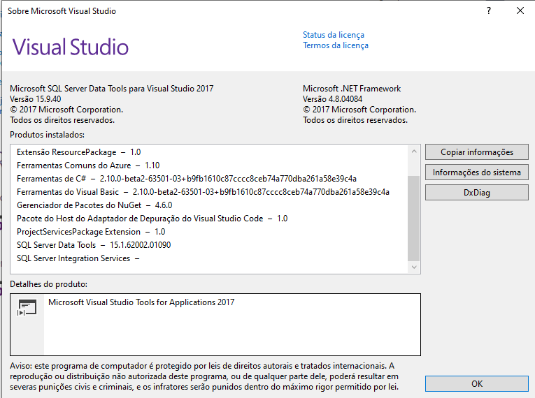
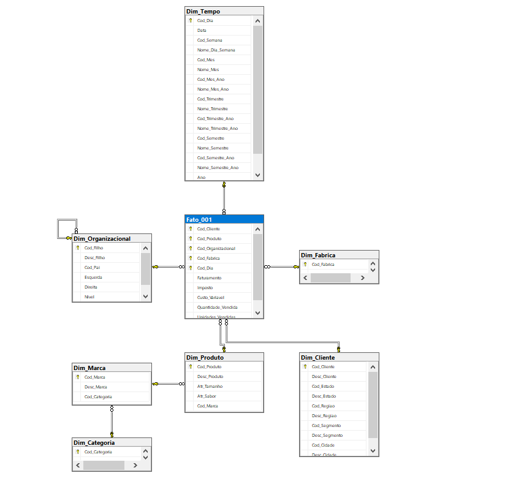
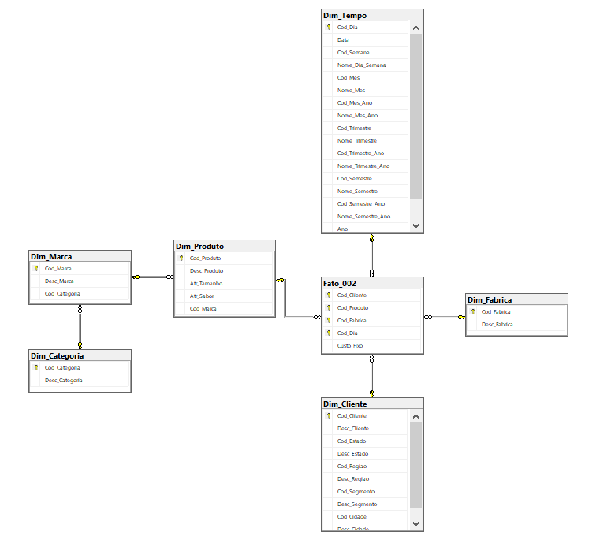
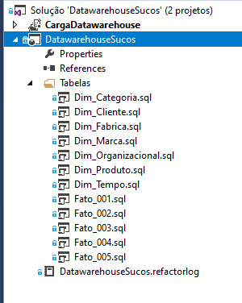
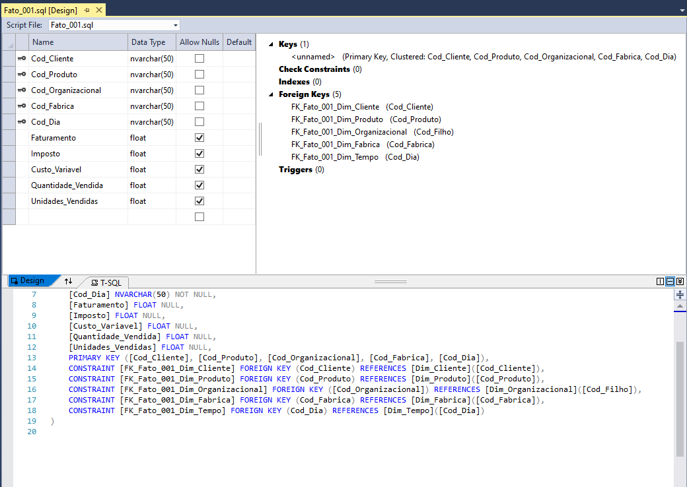
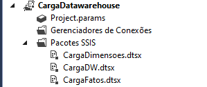
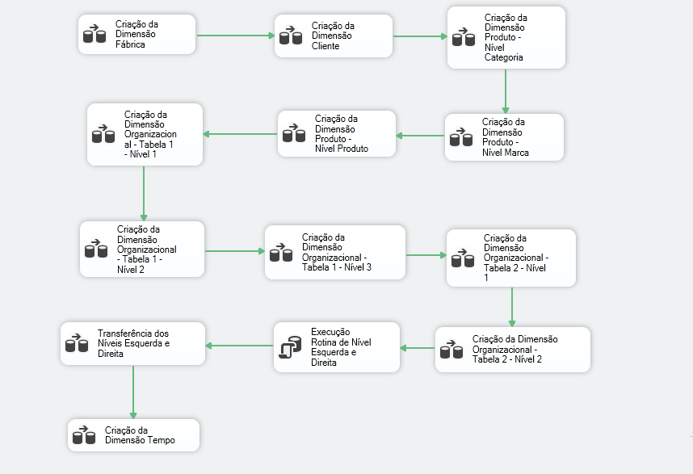
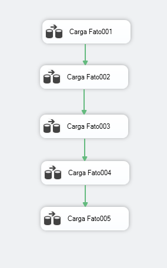
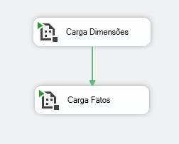

# SSIS-DW-SUCOS

Este repositório contempla o projeto construído nos treinamentos ministrados pelo professor <a href="https://cursos.alura.com.br/user/victorino-vila">Victorino Vila</a> pela plataforma Alura. O curso ensina como construir um Data Warehouse utilizando o Microsoft SQL Server Data Tools, abordando o entendimento do processo de ETL.

Para visualizar detalhes, deixo abaixo os links das partes I e II, respectivamente. 

https://www.alura.com.br/curso-online-business-intelligence-sql-server-e-integration-services
https://www.alura.com.br/curso-online-business-intelligence-sql-server-e-integration-services-parte2

A versão utilizada do Visual Studio e Data Tools, pode ser visualizada abaixo. 

O modelo de DW proposto, consiste em modelos Star Schema e Snowflake para atender da melhor maneira possível as necessidades propostas no desafio destes treinamentos. 

Star Schema
 

Snowflake
 

Após a definição dos modelos, objetivos, resoluções, é iniciado então a criação das tabelas utilizando um projeto de banco de dados no visual studio. Desse modo, torna-se possível realizar as criações de todas as tabelas em um banco de dados SQL conforme imagem abaixo.

Após a estruturação, gostaria de ressaltar a preocupação do instrutor em sempre manter um padrão seja no projeto, nas tabelas, nos scripts para maior organização e estruturação facilitando até mesmo possíveis manutenções e melhorias. Desse modo, exemplifico abaixo a criação de uma tabela no SQL Server utilizando o projeto de SQL no visual studio. 

Após isso, de maneira bem resumida, irei demonstrar as cargas utilizadas no integration services, nas quais foram divididas em dimensões, fatos e dw (que agrega as duas anteriores). 

Para a carga da dimensão, foi elaborado o seguinte fluxo: 

Posteriormente, a carga dos dados referentes as tabelas fatos, foi realizada da seguinte maneira: 

E finalmente, a carga que contempla as duas anteriores, foi realizada utilizando a Tarefa de Execução de Pacote, tornando possível executar os processos das dimensões e fato em sequência. 

Por se tratar de um projeto que não é de minha autoria, optei por não abordar os detalhes técnicos visto que demandaria um tempo relativamente alto para descrever todo o conteúdo e racional utilizado, e além disso, aproveito para recomendar estes dois treinamentos para todos os estudantes, profissionais e interessados em um contato maior com essa ferramenta poderossíma que é o Integration Services. 

Vale ressaltar que realizei alguns outros treinamentos e cursos desta ferramenta, porém até o momento, nenhum com tanta qualidade igual este oferecido pela Alura. 

